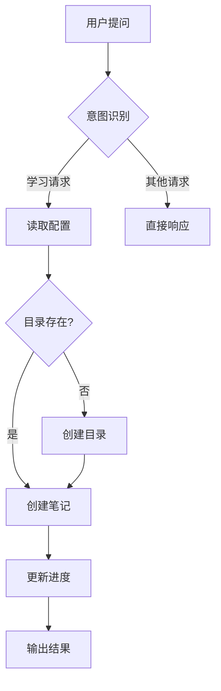

# 【Agent 配置与目录管理机制】- Trae IDE 学习笔记

## 一、知识点拆解

### 1. 知识范畴定位

**刚刚的操作属于「Agent 配置与目录管理」知识范畴**，包含以下核心模块：

| 知识模块 | 内容说明 | 重要性 |
|----------|----------|--------|
| **Skill 目录结构** | `.trae/skill/[skill-name]/` 的规范设计 | ⭐⭐⭐ |
| **配置驱动架构** | 通过外部 JSON 文件动态配置行为 | ⭐⭐⭐ |
| **交互式目录规划** | 基于用户输入动态创建目录结构 | ⭐⭐ |
| **笔记归档策略** | 按主题-子主题分层组织学习内容 | ⭐⭐ |

### 2. Trae IDE 技能系统架构

```
┌─────────────────────────────────────────────────────────────┐
│                    Trae IDE 技能系统                        │
├─────────────────────────────────────────────────────────────┤
│                                                             │
│  ┌─────────────┐    ┌─────────────┐    ┌─────────────┐     │
│  │   SKILL.md  │    │  prompt.md  │    │  配置文件   │     │
│  │ (技能定义)  │    │ (规则引擎)  │    │ (动态参数)  │     │
│  └──────┬──────┘    └──────┬──────┘    └──────┬──────┘     │
│         │                  │                  │             │
│         ▼                  ▼                  ▼             │
│  ┌─────────────────────────────────────────────────┐       │
│  │               Agent 执行引擎                    │       │
│  │  ┌────────────┐ ┌────────────┐ ┌────────────┐  │       │
│  │  │ 意图识别   │→│ 规则匹配   │→│ 执行逻辑   │  │       │
│  │  └────────────┘ └────────────┘ └────────────┘  │       │
│  └─────────────────────────────────────────────────┘       │
│                                                             │
├─────────────────────────────────────────────────────────────┤
│                      用户交互层                            │
│         自然语言提问 → 意图识别 → 执行 → 格式化输出         │
│                                                             │
└─────────────────────────────────────────────────────────────┘
```

### 3. 核心组件解析

| 组件 | 文件 | 作用 |
|------|------|------|
| **Skill 定义** | `SKILL.md` | 定义技能的元数据、触发规则、执行流程 |
| **规则引擎** | `prompt.md` | 指导 Agent 行为的规则集合（角色、职责、输出格式） |
| **配置文件** | `study_config.json` | 动态参数配置（输出目录、学习进度等） |

### 4. 目录规划机制流程

```
用户请求归档
      │
      ▼
检查主题目录是否存在
      │
      ├─ 不存在 → 创建主题目录
      │
      ▼
询问是否创建子目录
      │
      ├─ 否 → 直接归档
      │
      ├─ 是 → 选择子目录类型
      │         │
      │         ▼
      │     创建子目录
      │         │
      │         ▼
      │     移动笔记到对应子目录
      │
      ▼
询问是否继续规划
      │
      ├─ 是 → 继续创建/调整
      │
      └─ 否 → 结束规划
```

## 二、实战案例

### 案例1: 目录结构创建

```powershell
# 创建主题目录
New-Item -ItemType Directory -Force -Path "E:\Yang\learn\my-study\agent"

# 创建子目录
New-Item -ItemType Directory -Force -Path "E:\Yang\learn\my-study\agent\rules"
New-Item -ItemType Directory -Force -Path "E:\Yang\learn\my-study\agent\skills"
New-Item -ItemType Directory -Force -Path "E:\Yang\learn\my-study\agent\config"
New-Item -ItemType Directory -Force -Path "E:\Yang\learn\my-study\agent\practice"

# 移动笔记
Move-Item -Path "source.md" -Destination "E:\Yang\learn\my-study\agent\rules\" -Force
```

### 案例2: 配置文件读取

**study_config.json**
```json
{
  "notes_directory": "E:\\Yang\\learn\\my-study",
  "current_topic": "agent",
  "topics": [
    {
      "name": "agent",
      "title": "Agent 技能系统",
      "completed_chapters": 2,
      "total_chapters": 10
    }
  ]
}
```

### 案例3: 流程图输出规则（新增）

**Mermaid 流程图示例**


## 三、关联知识点

### 前置知识
- **JSON 格式**: 用于配置文件的编写和解析
- **Markdown 语法**: 用于编写技能定义和学习笔记
- **命令行操作**: 目录创建、文件移动等基础操作
- **提示词工程**: prompt.md 的设计原则

### 后续知识
- **技能组合**: 多个 Skill 协作完成复杂任务
- **动态配置**: 根据环境变量调整行为
- **技能市场**: 共享和发现社区技能
- **自动化工作流**: 基于规则的自动执行

### 交叉知识
- **微服务架构**: Skill 类似独立服务，可组合调用
- **策略模式**: 不同规则对应不同行为
- **配置管理**: 集中化配置与动态更新

---
*学习进度: 2/10 章节*
