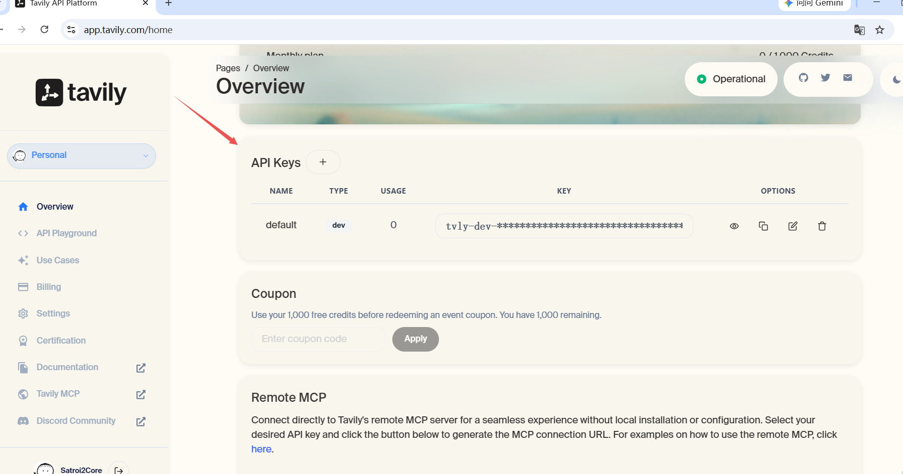
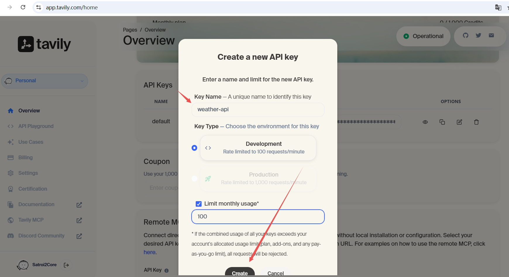
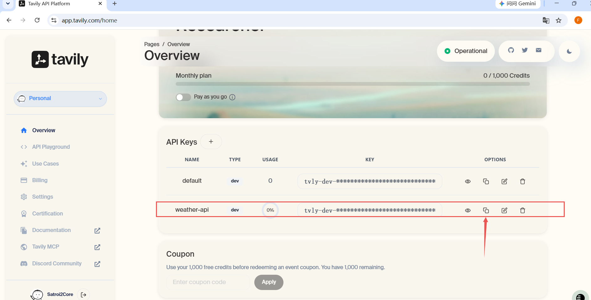

# 模型/agent基础配置说明

## 1. 资源配置
- **Tavily API Key**：用于访问 Tavily API，获取搜索结果。
- **Model API Key**：用于访问模型 API，获取模型推理结果。
- **Model Base URL**：模型 API 的基础 URL，用于构建 API 请求。
- **Model Name**：要使用的模型名称，用于指定模型推理任务。

---

### 1.1 Tavily API Key
- **获取**：从 Tavily 官方获取 API Key。
- **配置**：将获取到的 API Key 配置到 `config.py` 中的 `TAVILY_API_KEY` 变量中。

作用 :

- 用于调用Tavily搜索API
- 在我们的项目中，用来搜索旅游景点信息
- 这是一个专门为AI优化的搜索引擎API

如何获取？

1. 访问 https://www.tavily.com/
2. 点击 "Sign Up" 注册账号（有免费额度）
3. 注册后登录，进入 Dashboard
4. 在 API Keys 页面创建新的API密钥
5. 复制密钥到配置文件中
> 免费额度 : 通常每月有1000次免费搜索请求

---

### 1.2 Model API Key
- **获取**：从模型供应商（如 ModelScope）获取 API Key。
- **配置**：将获取到的 API Key 配置到 `config.py` 中的 `MODEL_API_KEY` 变量中。

作用 :

- 用于调用模型推理API
- 在我们的项目中，用来根据用户输入生成模型推理结果
- 这是一个专门为AI优化的模型推理API

如何获取？

1. 访问 https://modelscope.cn/
2. 注册/登录账号
3. 进入个人中心 → API Keys
4. 创建新的API密钥
5. 复制密钥到配置文件中
> 费用 : 魔搭平台有免费额度，适合学习和测试

---

### 1.3 Model Base URL
作用 :

- 用于构建模型推理API的URL
- 在我们的项目中，用来根据用户输入生成模型推理结果
- 这是一个专门为AI优化的模型推理API

为什么需要这个 :

- 不同的AI服务商有不同的API地址
- 这样设计可以方便切换不同的服务商
是否需要修改 :

- 一般不需要修改，除非你要切换到其他平台
> 比如 : 从ModelScope切换到OpenAI

---

### 1.4 Model Name
作用 :

- 指定使用哪个具体的大模型
- "Qwen/Qwen2.5-72B-Instruct" 是通义千问2.5版本
- 72B表示模型有720亿参数，Instruct表示是对话优化版本

其他可选模型 :

- Qwen/Qwen2.5-7B-Instruct (更小更快，适合简单任务)
- Qwen/Qwen2.5-14B-Instruct (中等规模)
- 其他开源模型如Llama、ChatGLM等

选择建议 :

- 学习阶段用7B或14B版本即可
- 72B版本效果更好但速度稍慢