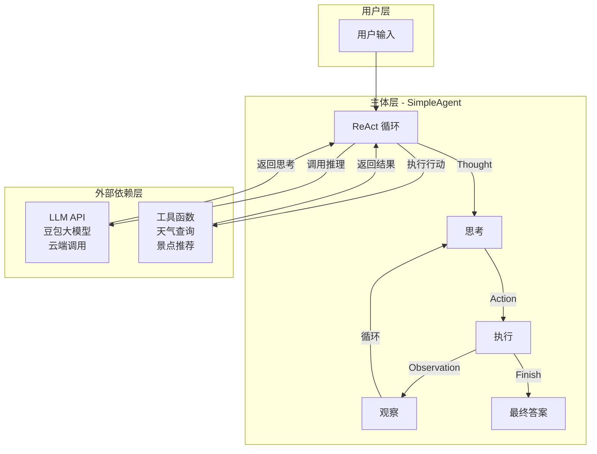
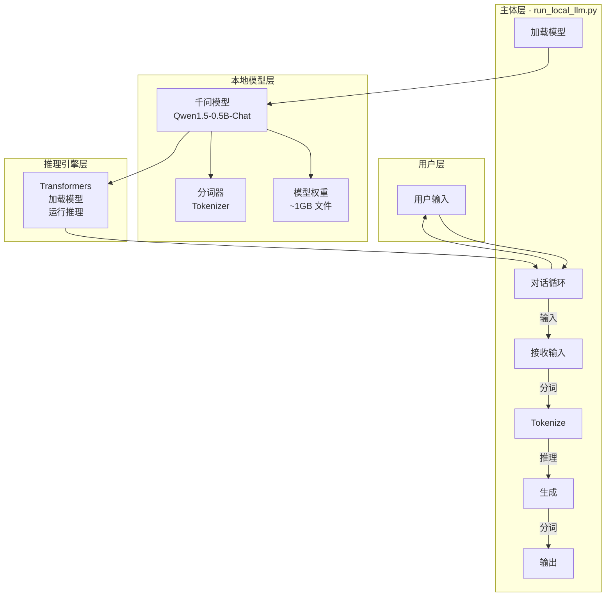
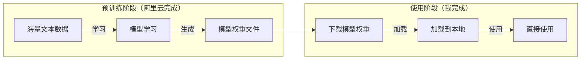
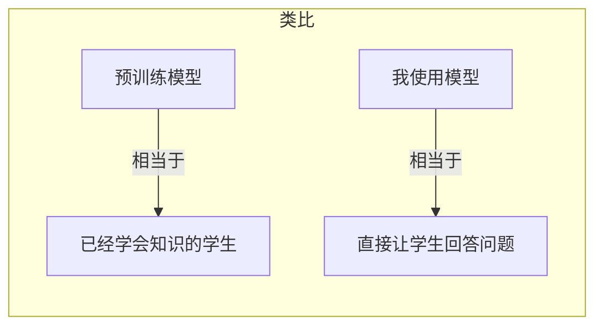
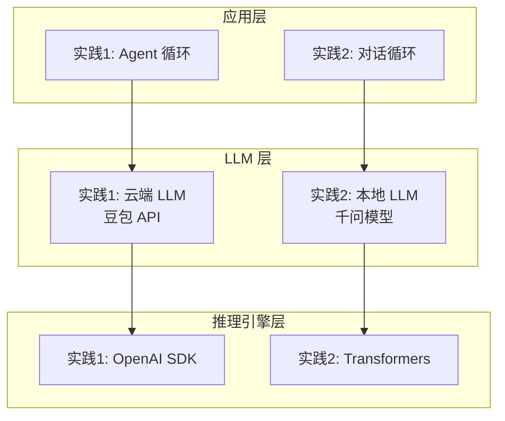
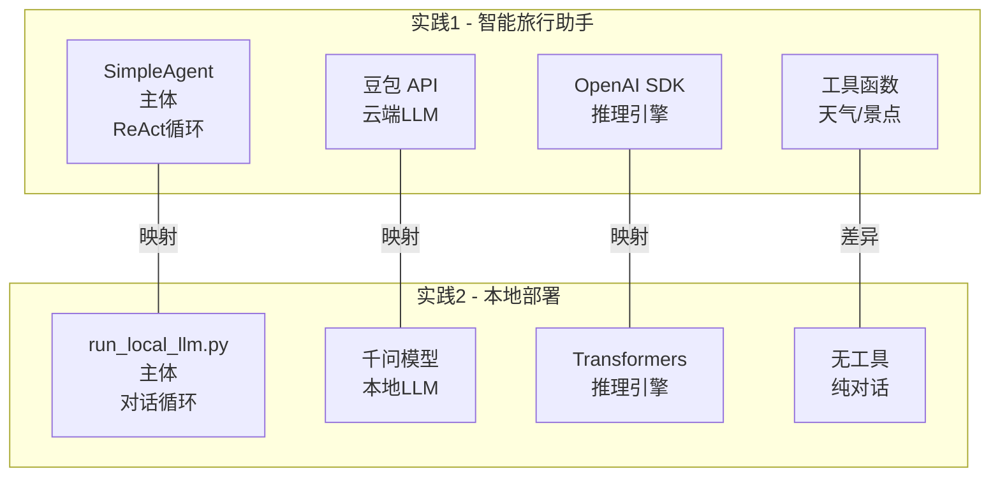
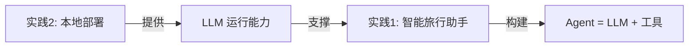

# Hello-Agents 实践认知笔记

> 两个实践的架构对比与组件映射关系

---

## 一、第一个实践：智能旅行助手

### 核心架构是什么？

第一个实践的核心是 **ReAct 循环**：

```
用户输入 → 思考(Thought) → 行动(Action) → 观察(Observation) → 循环 → 最终答案
```

### 架构图



### 主体与外部依赖的角色

| 组件 | 角色 | 职责 |
|------|------|------|
| **SimpleAgent** | 主体 | 控制循环流程、解析响应、执行工具 |
| **LLM API** | 外部依赖 | 提供思考能力（推理、决策） |
| **工具函数** | 外部依赖 | 提供行动能力（查询天气、推荐景点） |

**理解**：
- Agent 是"大脑"，负责协调
- LLM 是"思考引擎"，负责推理和决策
- 工具是"手脚"，负责执行具体任务

---

## 二、第二个实践：本地部署大语言模型

### 核心架构是什么？

第二个实践的核心是 **本地运行 LLM**：

```
加载模型 → 接收输入 → 推理生成 → 输出回答
```

### 架构图



### 实践中千问模型的定位是什么？

**千问（Qwen）** 是阿里云开源的大语言模型系列。
**理解**：千问模型是一个"已经训练好的大脑"，我下载后可以直接使用，不需要自己训练。

### 预训练模型是什么？

**预训练** 是指模型在海量数据上学习的过程。



**关键认知**：
- 下载的模型是 **已经训练好的**
- 只需要下载和使用，不需要自己训练

**类比理解**：



---

## 三、两个实践的对比与共通之处

### 核心共通点：都需要 LLM

两个实践的核心都是 **大语言模型（LLM）**：



### 关键差异对比

| 维度 | 实践1（智能旅行助手） | 实践2（本地部署） |
|------|---------------------|-----------------|
| **LLM 来源** | 云端 API（豆包） | 本地模型（千问） |
| **推理引擎** | OpenAI SDK | Transformers |
| **运行位置** | 云端服务器 | 本地电脑 |
| **网络依赖** | 必须联网 | 断网也能用 |
| **隐私保护** | 数据上传云端 | 数据不出本地 |
| **成本** | 每次调用付费 | 下载后免费 |
| **速度** | 服务器快 | 本地较慢 |

### 我的认知：LLM 是智能体的核心

通过两个实践，我初步认识到：

```mermaid
flowchart LR
    subgraph Formula["公式"]
        Agent[智能体] = LLM + Tools + Loop[循环机制]
    end

    subgraph Practice1["实践1"]
        P1Agent[Agent] = P1LLM[云端LLM] + P1Tools[工具函数] + P1Loop[ReAct循环]
    end

    subgraph Practice2["实践2"]
        P2Agent[对话] = P2LLM[本地LLM] + P2Tools[无工具] + P2Loop[简单循环]
    end
```

**关键理解**：
- LLM 是智能体的"大脑"，提供推理能力
- 实践1 展示了 LLM 如何驱动智能体
- 实践2 展示了 LLM 本身是什么、如何运行

---

## 四、组件映射关系

### 两个实践的组件对比



### 映射关系表

| 组件类型 | 实践1 | 实践2 | 映射关系 |
|---------|------|------|---------|
| **主体** | SimpleAgent | run_local_llm.py | 都是控制流程的代码 |
| **LLM** | 豆包 API（云端） | 千问模型（本地） | 都是"大脑"，只是位置不同 |
| **推理引擎** | OpenAI SDK | Transformers | 都是加载和运行 LLM 的工具 |
| **循环机制** | ReAct 循环 | 对话循环 | 都是输入→处理→输出的流程 |
| **工具** | 天气查询、景点推荐 | 无 | 实践1 有工具，实践2 纯对话 |

### 理解：为什么有差异？

**实践1 的目的**：展示智能体如何工作
- 需要工具来展示 Agent 的"行动"能力
- 使用云端 LLM 更简单（无需本地部署）

**实践2 的目的**：展示 LLM 本身是什么
- 不需要工具，专注于模型运行
- 使用本地模型展示"本地部署"的概念

---

## 五、总结：我的认知框架

### 两个实践的关系



**理解**：
- 实践2 解决了"如何运行 LLM"的问题
- 实践1 解决了"如何用 LLM 构建智能体"的问题
- 两者结合：用本地 LLM 构建智能体（后续可探索）

### 核心认知

| 认知点 | 理解 |
|-------|---------|
| **LLM 是什么** | 一个已经训练好的"大脑"，可以处理文本 |
| **预训练模型** | 别人训练好的模型，我下载后直接使用 |
| **千问模型** | 阿里云开源的 LLM，类似 GPT |
| **推理引擎** | 加载和运行模型的工具（如 Transformers） |
| **智能体** | LLM + 工具 + 循环机制 = 能自主行动的系统 |
| **云端 vs 本地** | LLM 可以在云端运行，也可以在本地运行 |

### 下一步探索方向

1. **用本地 LLM 替换云端 LLM**：将实践2的千问模型接入实践1的 Agent
2. **尝试更大的模型**：体验不同模型尺寸的性能差异
3. **学习量化技术**：让更大的模型也能在本地运行
4. **扩展工具**：给本地 LLM Agent 添加更多工具

---

## 附录：概念对照表

| 概念 | 实践1 中的体现 | 实践2 中的体现 |
|------|---------------|---------------|
| **LLM** | 豆包 API | 千问模型 |
| **推理** | OpenAI.chat.completions.create() | model.generate() |
| **分词** | API 自动处理 | tokenizer.apply_chat_template() |
| **对话历史** | messages 列表 | 对话历史拼接 |
| **系统提示词** | SYSTEM_PROMPT | system 消息 |
| **生成参数** | temperature=0.7 | temperature=0.7, max_new_tokens=512 |


---

**学习日期**：2026-06-10
**实践项目**：智能旅行助手 + 本地部署 LLM
**学习状态**：已完成两个实践，建立初步认知框架
